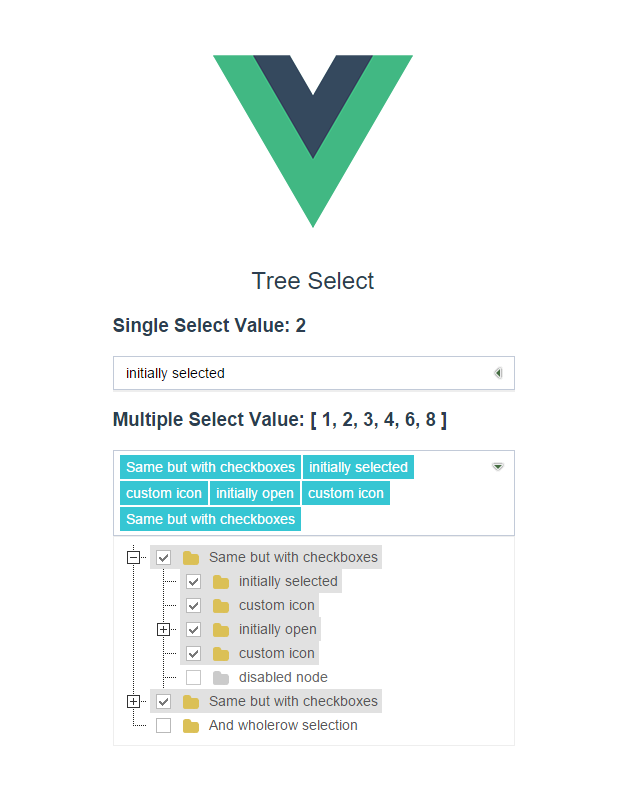

# vue-treeselect

[](https://github.com/zdy1988/vue-treeselect)

##  Introduction

A tree plugin for vue2



This Plugin is based on [vue-jstree](https://github.com/zdy1988/vue-jstree), Some "props" can be used for reference !

##  DEMO

[http://zdy1988.github.io/vue-treeselect](http://zdy1988.github.io/vue-treeselect)

##  NPM

```html
    npm install vue-treeselect
```

##  ES6

```html
    import VTreeselect from 'vue-treeselect'
    
    new Vue({
      components: {
        VTreeselect
      }
    })
```

##  Setup

```html
    npm install
    npm run dev
```

## Usage

```html
    <v-tree-select :data="data" value-field-name="id" v-model="selectItem"></v-tree-select>
    
      new Vue({
        el: '#app',
        data: {
          data: [
            {
              "id": 1,
              "text": "Same but with checkboxes",
              "children": [
                {
                  "id": 2,
                  "text": "initially selected",
                },
                {
                  "id": 3,
                  "text": "custom icon",
                },
                {
                  "id": 4,
                  "text": "initially open",
                  "children": [
                    {
                      "id": 5,
                      "text": "Another node"
                    }
                  ]
                },
                {
                  "id": 6,
                  "text": "custom icon",
                },
                {
                  "id": 7,
                  "text": "disabled node",
                  "disabled": true
                }
              ]
            },
            {
              "id": 8,
              "text": "Same but with checkboxes",
              "children": [
                {
                  "id": 9,
                  "text": "initially selected",
                },
                {
                  "id": 10,
                  "text": "custom icon",
                },
                {
                  "id": 11,
                  "text": "initially open",
                  "children": [
                    {
                      "id": 12,
                      "text": "Another node"
                    }
                  ]
                },
                {
                  "id": 13,
                  "text": "custom icon",
                },
                {
                  "id": 14,
                  "text": "disabled node",
                  "disabled": true
                }
              ]
            },
            {
              "id": 15,
              "text": "And wholerow selection"
            }
          ],
          selectItem: null
        }
      })
```

## API

| Props        | Type           | Default  |  Describe  |
| ------------- |:-------------:|:-----:|:--------------------------------------------------------|
| placeholder      | String |  |  set  placeholder |
| data      | Array |  |  set tree data  |
| size      | String      |   |  set tree item size , value : 'large' or '' or ''small' |
| show-checkbox | Boolean      |    false |  set it show checkbox |
| allow-transition | Boolean      |    true | allow use transition animation  |
| whole-row | Boolean      |    false | use whole row state |
| no-dots | Boolean      |    false | show or hide dots || collapse | Boolean      |    false |  set all tree item collapse state |
| multiple | Boolean      |    false |  set multiple selected tree item  |
| allow-batch | Boolean      |    false | in multiple choices. allow batch select  |
| text-field-name | String      |    'text' |  set tree item display field |
| value-field-name | String      |    'value' |  set tree item value field |
| children-field-name | String      |    'children' |  set tree item children field |
| async | Function      |     |  async load callback function , if node is a leaf ,you can set 'isLeaf: true' in data  |
| loading-text | String      |    'Loading' |  set loading text |
| klass | String      |     |  set append tree class |

## Data Item Optional Properties

| Name        | Type           | Default  | Describe  |
| ------------- |:-------------:| -----:|:----------------------------------------------|
| icon      | String      |   | custom icon css class |
| opened | Boolean      |    false | set leaf opened |
| selected | Boolean      |    false | set node selected |
| disabled | Boolean      |    false | set node disabled |
| isLeaf | Boolean      |    false | if node is a leaf , set true can hide '+' |